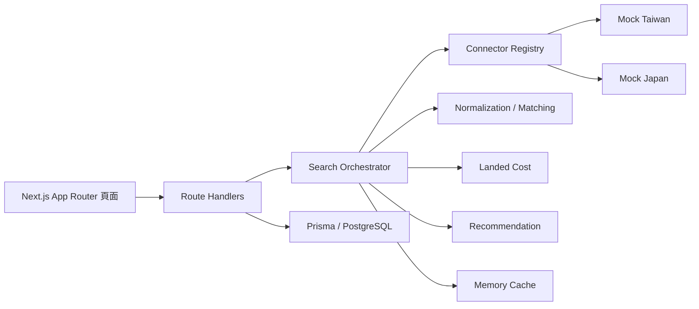

# SmartPrice MVP 架構與階段規劃

## 1. 系統架構與資料流



使用者經由首頁或搜尋頁送出關鍵字。`/api/search` 驗證參數後，Orchestrator 平行呼叫已啟用的 Connector、正規化商品、估算到手價、評分、排序與分頁。單一來源失敗時保留其他結果。所有模擬商品必須標示「模擬資料」。目前搜尋與收藏等路徑仍主要使用記憶體資料；資料庫 Schema 與初始 migration 已備妥，持久化整合列入後續階段。

主要模組：`src/connectors` 處理來源差異；`src/services` 處理搜尋、快取、比對、成本與推薦；`src/app/api` 提供 API；`src/app` 與 `src/components` 提供響應式介面；`prisma` 管理資料模型與種子資料。

## 2. 資料庫 Schema 規劃

| Model | 用途 | 主要關聯與約束 |
| --- | --- | --- |
| CanonicalProduct | 標準商品與識別碼 | 一對多 ProductOffer；品牌、型號索引 |
| ProductOffer | 各來源報價與成本 | 來源與來源商品 ID 唯一；連至標準商品 |
| ProductVariant | 顏色、容量、電壓等變體 | 多對一 ProductOffer |
| PriceHistory | 報價時間序列 | 連至 Offer 與標準商品 |
| UserFavorite | 收藏與目標價 | 依使用者 ID 索引；後續需與登入整合 |
| ConnectorLog | 來源健康與錯誤紀錄 | 依來源及時間索引 |

金額採 Decimal；商品規格與原始資料採 JSONB。正式登入後應為收藏加入使用者外鍵，並避免匿名資料跨使用者共享。

## 3. 專案目錄結構

```text
src/app/                 頁面與 API Route Handlers
src/components/          共用 UI
src/connectors/          來源介面、Registry、Mock 與 Amazon 預留
src/services/            搜尋、正規化、比對、計價、推薦、快取
src/types/               商業資料型別
src/lib/                 伺服器端共用功能
scripts/                 TypeScript 執行註冊
prisma/                  Schema、Migration、Seed
tests/unit/              商業規則測試
tests/integration/       搜尋整合測試
docs/                    架構與階段規劃
```

## 4. 開發階段拆解

1. **基礎可執行性**：文件、環境範本、Docker、初始 migration、編譯修正、管理 API 基本存取保護。
2. **搜尋核心**：已加入查詢解析、主要篩選與排序、來源 timeout 與程序內速率限制、變體衝突比對和到手價註記；進一步的規格語意解析與共用速率限制可在正式來源接入時擴充。
3. **持久化與身分**：已將收藏、目標價、價格歷史與 Connector 執行紀錄接入 Prisma，加入匿名身分隔離及可選 Google／Microsoft 登入；電子郵件寄送與登入後資料合併仍需後續完成。
4. **介面完善**：搜尋狀態、比較、詳情、收藏與管理頁，補齊行動版和安全的外部連結。
5. **品質與部署**：單元、整合、端對端測試，ESLint/Prettier、正式部署設定與來源擴充指南。

## 5. 第一階段檔案清單

| 檔案 | 用途 |
| --- | --- |
| `docs/architecture.md`、`README.md` | 架構與使用說明 |
| `.env.example`、`.gitignore`、`.dockerignore` | 本機設定與檔案排除 |
| `Dockerfile`、`docker-compose.yml` | 容器化執行 |
| `prisma/migrations/*`、`prisma/seed.ts` | 初始資料庫結構與型別修正 |
| `src/lib/admin-auth.ts`、`src/app/api/connectors/*` | 管理操作保護 |

第一階段完成後仍需檢查第二至第五階段的驗收條件；現有頁面與 API 不代表全部條件已完成。
